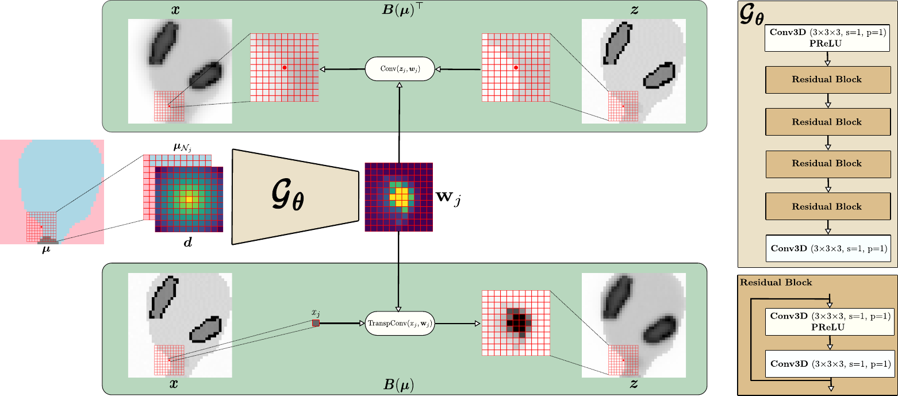
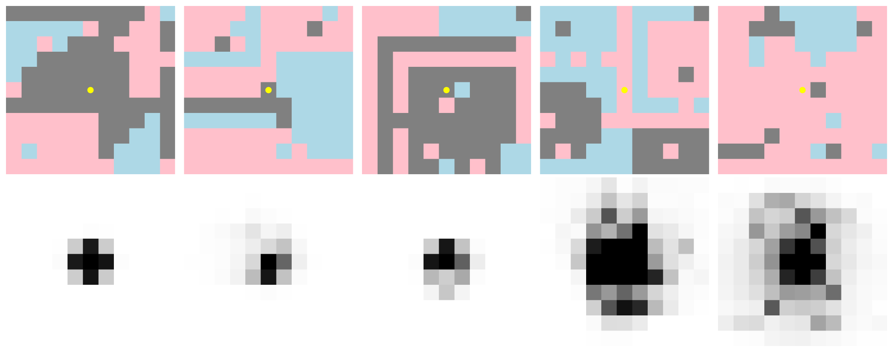
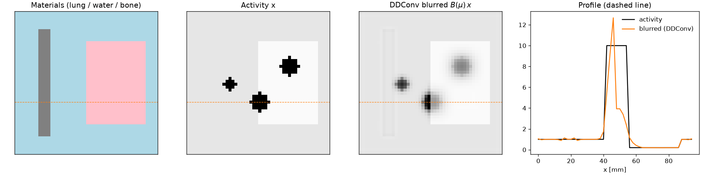
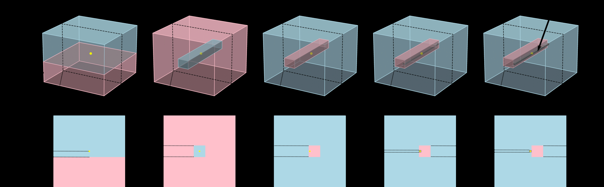
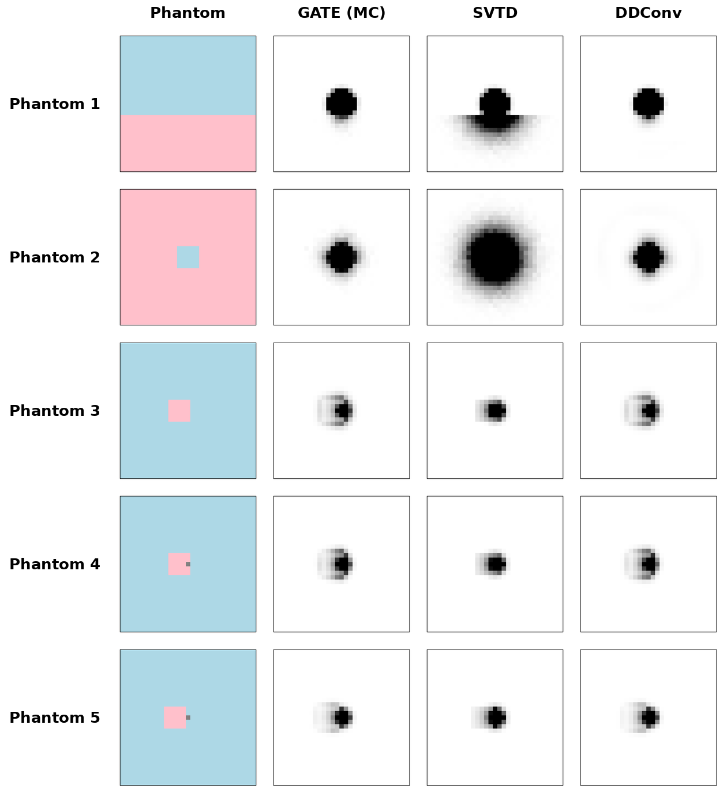
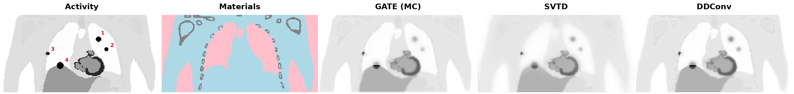
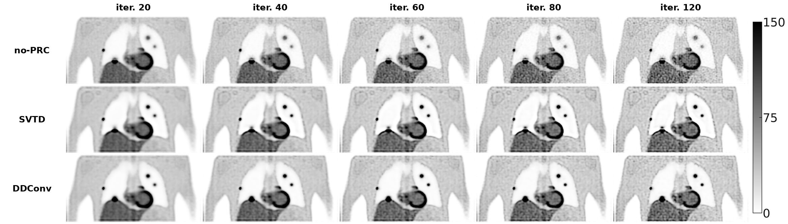

# DDConv: Dual-Input Dynamic Convolution for Positron Range Correction

Code for the paper

> **Dual-Input Dynamic Convolution for Positron Range Correction in PET Image Reconstruction**
> Youness Mellak, Alexandre Bousse, Thibaut Merlin, Élise Émond, Mikko Hakulinen, Dimitris Visvikis
> *IEEE Transactions on Radiation and Plasma Medical Sciences*, 2025.
> [DOI 10.1109/TRPMS.2025.3647264](https://doi.org/10.1109/TRPMS.2025.3647264) · [arXiv:2503.00587](https://arxiv.org/abs/2503.00587)

DDConv is a learned, spatially variant **positron range (PR)** blurring operator for **Ga-68** PET.
A small CNN predicts a per-voxel PR point spread function (PSF) from the local attenuation map.
The forward operator **B(μ)** and its exact transpose **B(μ)ᵀ** are then applied inside iterative
(ML-EM / OSEM) reconstruction. The repository contains the full pipeline: synthetic phantoms →
GATE Monte Carlo simulations → training → inference as a CASToR plugin, with pretrained weights.



---

## Contents

- [Motivation](#motivation)
- [Background: from a GNN to a convolutional hypernetwork](#background-from-a-gnn-to-a-convolutional-hypernetwork)
- [Method](#method)
- [Repository structure](#repository-structure)
- [Installation](#installation)
- [Quick start (CPU example and adjoint test)](#quick-start)
- [Workflow](#workflow)
- [Results](#results)
- [Limitations](#limitations)
- [Citation](#citation)
- [License](#license)

---

## Motivation

After emission, a positron travels some distance through tissue before it annihilates. This
**positron range** moves the detected annihilation away from the tracer location and blurs the image.
The range depends on the isotope's endpoint energy and on the electron density of the tissue:

| Isotope | Endpoint energy | PR in water |
|---|---|---|
| F-18  | 0.634 MeV | 0.6 mm |
| Ga-68 | 1.9 MeV   | 2.9 mm |
| Rb-82 | 3.4 MeV   | 5.9 mm |

For Ga-68 and Rb-82 the range is larger than the 2–4 mm resolution of modern scanners. The blur is
also strongly **anisotropic at tissue interfaces**: positrons travel far in lung and stop quickly in
bone or soft tissue. This affects lesion size and SUV.

PR correction is most consistent when the blur is modelled **inside** the system matrix,
H = A(μ) P B(μ), where A(μ) is attenuation, P is the geometric projector and B(μ) is the PR blur.
ML-EM uses both H and Hᵀ:

x⁽ᵠ⁺¹⁾ = x⁽ᵠ⁾ / (Hᵀ1) · Hᵀ( y / (H x⁽ᵠ⁾ + r) ),

so a PR model is only usable in this setting if it also provides the **transpose B(μ)ᵀ**. Image-to-image
networks that output a blurred image directly have no tractable transpose, which leaves the
forward and backward projectors unmatched.

## Background: from a GNN to a convolutional hypernetwork

This work follows earlier research on the same problem:

- **Fast-Track of F-18 positron path simulations using GANs** (ISBI 2024,
  [code: Mellak/Particles_Tracking_GAN](https://github.com/Mellak/Particles_Tracking_GAN)). This work
  speeds up Monte Carlo by generating positron paths with a GAN. Path-level simulation, even
  accelerated, still has no transpose and cannot be used directly as B(μ)ᵀ inside EM. That limitation
  led to modelling PR at the image level, as a linear operator.
- **One Linear Layer is All You Need for Positron Range Estimation and Correction** (IEEE NSS/MIC 2024
  poster, [DOI 10.1109/NSS/MIC/RTSD57108.2024.10657784](https://doi.org/10.1109/NSS/MIC/RTSD57108.2024.10657784)).
  This work tackled the same problem with a **graph neural network (GNN)** that locally predicts the
  weights of the sparse linear layer representing PR blurring. Because the operator is linear with
  explicit weights, its transpose comes for free.

DDConv keeps that idea, a *learned linear operator with an exact transpose*, but replaces the GNN
with a **convolutional hypernetwork**. A 3D CNN G_θ generates the weights (the PSF) of each voxel's
kernel, and the kernel is applied by **dynamic convolution**: a transposed convolution to spread
for B(μ), and a convolution to gather for B(μ)ᵀ. Working on the regular voxel grid makes it
simpler and faster on GPU than message passing on a graph, and more accurate at tissue interfaces.

## Method

**Dual input → per-voxel PSF.** For each voxel j, the network
G_θ receives two 11×11×11 channels:

1. the local attenuation patch **μ_Nj** (lung / water / rib bone at 511 keV), and
2. a constant **distance channel d**, which gives each neighbour's (negated, normalised) distance to the centre.

It outputs logits that a softmax turns into a PSF **w_j** (non-negative, summing to 1). Entry
w_{j→k} is the probability that a positron emitted in voxel j annihilates in voxel k.
The inference model (`FilterPredictor`) is a 3×3×3 conv + PReLU, four residual blocks and a final
conv. It is small enough to run on every heterogeneous voxel at each EM iteration.

**Forward and transposed operators.**

- **B(μ)x (spread):** z_k = Σ_{j∈N_k} w_{j→k} x_j, which distributes each activity value over its
  neighbourhood (`ConvTranspose3d` / `scatter_add`).
- **B(μ)ᵀz (gather):** x_j = Σ_{k∈N_j} w_{j→k} z_k, the weighted sum of the neighbourhood with the
  *same* PSF (`Conv3d` / dot product).

**Acceleration.** In homogeneous regions the PSF does not depend on position. The code builds a
homogeneity map: a voxel is homogeneous if at least 99% of its 11³ window is a single material.
Homogeneous voxels use a single cached kernel per material with a standard (transposed)
convolution. The CNN only runs on the remaining heterogeneous voxels, in batches. Both operators use
the same masks and kernels, so B(μ)ᵀ is the exact adjoint of B(μ) (see
[`tests/test_adjoint.py`](tests/test_adjoint.py)).

**Training.** 1,000 random 11×11×11 material phantoms (lung, water, rib bone) built from random
primitives plus 10% voxel-label noise. Each phantom has a Ga-68 point source at its centre,
simulated in GATE with 10⁶ positrons to get a noise-free annihilation PSF. The training loss is the
KL divergence between predicted and MC PSFs. In the paper the model was trained for 5,000 epochs
with Adam (lr = 1e-4, batch size 4), taking about 3 h on an RTX 3060 for the 11³ kernel.



*Random training material images (pink lung, blue water, grey bone; yellow = Ga-68 source) and their
GATE PSFs.*

## Repository structure

```
ddconv-prc/
├── phantoms/                 # 1) synthetic material phantoms + dataset preparation
│   ├── GeneratePhantoms.py   #    random 3D phantoms (.bin + Interfile .h33 header for GATE)
│   ├── PrepareDataSet.py     #    GATE outputs → Emission/Stop/MuMap datasets, cropped to 31³, 21³, 11³
│   └── scripts/              #    SLURM array launchers
├── gate/                     # 2) GATE Ga-68 point-source simulations (see gate/ReadMe.md)
├── training/                 # 3) PSF predictor training
│   ├── train.py              #    CLI: model, kernel size, loss (KL used in the paper), ...
│   ├── model.py              #    FilterPredictor (+ UNet / FastUNet3D variants)
│   ├── DataLoader.py
│   └── scripts/launch_train.sh
├── inference/                # 4) B(μ) and B(μ)ᵀ as a CASToR plugin (see inference/ReadMe.md)
│   ├── PR_CNN_gate.py        #    forward operator B(μ)
│   ├── PR_CNN_gate_T.py      #    transposed operator B(μ)ᵀ
│   ├── model.py, utils.py
│   ├── mmatkernels.conf      #    CASToR-side configuration
│   └── Weights/              #    pretrained weights for 11³, 21³ and 31³ kernels (2-mm voxels, Ga-68)
├── examples/run_synthetic_phantom.py   # CPU demo on a lung/water/bone phantom
├── tests/test_adjoint.py               # dot-product test ⟨Bx, y⟩ = ⟨x, Bᵀy⟩
└── docs/figures/                       # figures from the paper
```

## Installation

```bash
git clone https://github.com/Mellak/ddconv-prc.git
cd ddconv-prc
python -m venv .venv && source .venv/bin/activate
pip install -r requirements.txt   # PyTorch ≥ 2.0; install the CUDA build from pytorch.org for GPU use
```

Other tools: [GATE](http://www.opengatecollaboration.org/) (the paper used the `gate_latest`
container) for the simulations, and [CASToR](https://castor-project.org/) for reconstruction.
The cluster scripts (`*.sh`) use SLURM + Singularity and absolute paths from the original
environment. Adapt them to your machine.

## Quick start

Both scripts run on CPU with the included 11³ weights. They call the real operator functions
(`simulate_pr_forward` / `simulate_pr_transpose`) through temporary raw files, as CASToR does.

```bash
python examples/run_synthetic_phantom.py   # ≈40 s on 4 CPU cores
pytest -s tests/test_adjoint.py            # ≈30 s on 4 CPU cores
```

The example builds a 24×48×48 phantom (2-mm voxels) with water, a lung block, a rib-bone slab and
three hot lesions (in lung, at the lung/water interface and next to bone). It applies B(μ) and
writes `examples/output/synthetic_phantom_before_after.png`:



Total activity is preserved (ratio 1.0000). Activity in the lesion that straddles the interface
spreads widely into the lung and piles up just inside the water. A single isotropic kernel cannot
reproduce this asymmetry.

The adjoint test gives `relative error = 1.2e-06` (float32 precision), on a μ-map with both
homogeneous voxels (convolution path) and heterogeneous voxels (CNN path).

## Workflow

### 1. Phantom generation

```bash
python phantoms/GeneratePhantoms.py 2.0 0001 --output_root /path/to/NewData
```

This writes `Phantoms_Ga68_2.0mm/Phantom_0001/image_0001.{bin,h33}`. The volume is 31³ at 2 mm,
which covers the ≈30 mm maximal Ga-68 range in lung. For another isotope or voxel size, change
`--max_dist_of_radius` and `--base_resolution`. Geometry, number of zones and shapes, and the
voxel-noise fraction are all CLI options. `phantoms/scripts/GeneratePhantoms.sh` generates 1,000
phantoms as a SLURM array.

### 2. GATE simulations

`gate/main_PR.mac` loads the voxelized phantom (`phantom_prange.mac`), puts a Ga-68 ion source at the
centre (`point_source.mac`) and records positron production and annihilation (stop) maps with
`ProductionAndStoppingActor` (31³, 2 mm), plus the 511-keV μ-map with `MuMapActor`.

```bash
Gate -a [resolution,2][number,0001] gate/main_PR.mac   # see gate/0LoopGa68.sh for the array job
```

Then gather the outputs into training datasets (full 31³, crop 21³ and extreme crop 11³):

```bash
python phantoms/PrepareDataSet.py 0001 2.0 --data_root /path/to/NewData
```

Details on materials, range tables and changing the isotope are in [`gate/ReadMe.md`](gate/ReadMe.md).

### 3. Training

```bash
python training/train.py --model filter --kernel_size 11 --loss kl \
    --epochs 5000 --batch_size 4 --lr 1e-4 \
    --data_root /path/to/Dataset_Excrop_2mm --run_name filter_k11_kl
```

`--data_root` must contain `Emission/`, `MuMap/` and `Stop/`. Distance-channel options
(`--negate_dist 1 --dist_normalize max`) must match inference, and these are the defaults.
`training/scripts/launch_train.sh` lists all parameters used.

### 4. Inference in CASToR (ML-EM / OSEM)

The PR blur enters the system model as H = A(μ) P B(μ). At each iteration, CASToR calls
`inference/PR_CNN_gate.py` for **B(μ)** in the forward projection and
`inference/PR_CNN_gate_T.py` for **B(μ)ᵀ** in the backprojection (`transpose_mtx : 1` in
`mmatkernels.conf`). Each script reads the current image (its second command-line argument) and
writes the result as a raw float32 volume (`result_image.bin` / `result_image_T.bin` in `model_dir`).

Before reconstructing, edit for your data:

- `inference/mmatkernels.conf`: `model_dir` (folder with the scripts and weights) and `path_umap`
  (μ-map);
- the `__main__` block of **both** scripts: `path_mat_image` (μ-map, raw float32), the grid `DIM`
  (Z, Y, X), `kernel_size` (11, 21 or 31, matching `Weights/fpred_model_{K}.pth`), and the
  kernel / cache / output folders.

The μ-map must be on the reconstruction grid, with 2-mm voxels for the shipped weights. Values are
snapped to {lung 0.0247, water 0.0959, rib bone 0.171}, and anything below lung is treated as lung.
Material masks, the homogeneity map and per-material kernels are cached on the first call, so later
iterations only run the CNN on heterogeneous voxels. Both functions can also be called from Python
for other reconstruction frameworks (see `examples/` and `tests/`). More details are in
[`inference/ReadMe.md`](inference/ReadMe.md).

## Results

All results below are from the paper. Simulated data used a Siemens mMR model with 200-ps TOF, and
reconstructions used CASToR EM on 2-mm voxels.

**Experiment 1: PSFs at interfaces.** On five digital phantoms with lung/water/bone interfaces,
DDConv PSFs closely match GATE. The SVTD baseline (Kertész et al., 2022), which cuts and assembles
per-tissue MC kernels, deviates at the interfaces.





**XCAT PR blurring.** A Ga-68 XCAT phantom with four lesions: two in lung, one at the lung/soft-tissue
interface and one at the lung/liver interface. SVTD blurs the lung lesions correctly but not the
interface lesions. DDConv nearly matches the MC reference everywhere.



**Experiment 2: XCAT reconstruction** (120 EM iterations, 200×200×100 voxels):



- Lesions in homogeneous lung (1, 2): SVTD and DDConv are almost identical (RC ≈ 0.5–0.6,
  MAPE ≈ 45–50%) and both beat no-PRC.
- Interface lesions (3, 4): SVTD over-corrects (RC > 1.0, SUVmax error > 200%). DDConv keeps
  RC ≈ 1.0, SUVmax error < 120% and the lowest MAPE (35–45%).

**Experiment 3: real phantom** (Siemens Biograph Vision, Kuopio University Hospital): DDConv and
SVTD agree in soft tissue. At the lung/soft-tissue interface DDConv gives more accurate activity
recovery and sharper delineation.

**Runtime** (full XCAT volume, GPU):

| Kernel | SVTD [s] | DDConv [s] | Accelerated DDConv [s] |
|---|---|---|---|
| 11³ | 18  | 74    | 18  |
| 21³ | 40  | 500   | 138 |
| 31³ | 120 | 1,620 | 480 |

For comparison, GATE needs about 1 min 40 s to simulate one 31³ kernel with 10⁶ positrons, while
DDConv predicts one in about 162 ms.

## Limitations

- **Tracer- and voxel-size specific.** The weights are for Ga-68 with 2-mm isotropic voxels. Other
  isotopes (e.g. Rb-82) or voxel sizes need new GATE data and retraining. The kernel size should
  scale with voxel spacing.
- **Three materials** (lung, water, rib bone). Other tissues are snapped to the nearest one. Adding
  materials means extending the GATE material and range tables, the phantom generator and the
  `MATERIALS` table in the inference scripts.
- **Kernel truncation.** An 11³ window (22 mm) keeps about 84% of the PSF energy in lung and about 100%
  in water and bone. Larger kernels (21³, 31³ weights included) recover the lung tail at a much
  higher cost.
- **Runtime** depends on the number of heterogeneous voxels, since the CNN runs once per such voxel.
  Large 31³ kernels are slow without a GPU.
- **Real-data validation is preliminary** (one physical phantom, no TOF).
- **Paths.** The CASToR entry points (`__main__` blocks) and cluster scripts contain absolute paths
  from the original environment and must be edited.

## Citation

```bibtex
@article{mellak2025ddconv,
  title   = {Dual-Input Dynamic Convolution for Positron Range Correction in PET Image Reconstruction},
  author  = {Mellak, Youness and Bousse, Alexandre and Merlin, Thibaut and {\'E}mond, {\'E}lise and
             Hakulinen, Mikko and Visvikis, Dimitris},
  journal = {IEEE Transactions on Radiation and Plasma Medical Sciences},
  year    = {2025},
  doi     = {10.1109/TRPMS.2025.3647264}
}
```

Predecessor (GNN approach):

```bibtex
@inproceedings{mellak2024one,
  title     = {One Linear Layer is All You Need for Positron Range Estimation and Correction},
  author    = {Mellak, Youness and Bousse, Alexandre and Merlin, Thibaut and {\'E}mond, {\'E}lise and
               Visvikis, Dimitris},
  booktitle = {IEEE Nuclear Science Symposium, Medical Imaging Conference and Room Temperature
               Semiconductor Detector Conference (NSS/MIC/RTSD)},
  year      = {2024},
  doi       = {10.1109/NSS/MIC/RTSD57108.2024.10657784}
}
```

## License

MIT, see [LICENSE](LICENSE).
